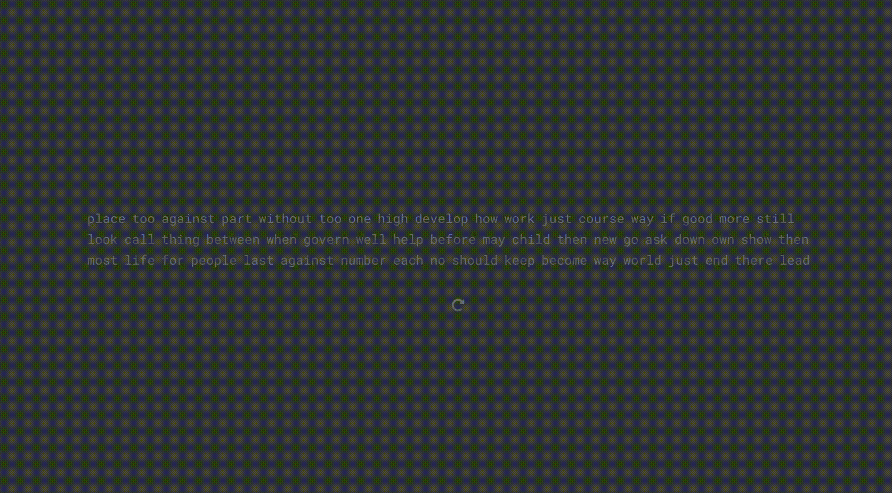
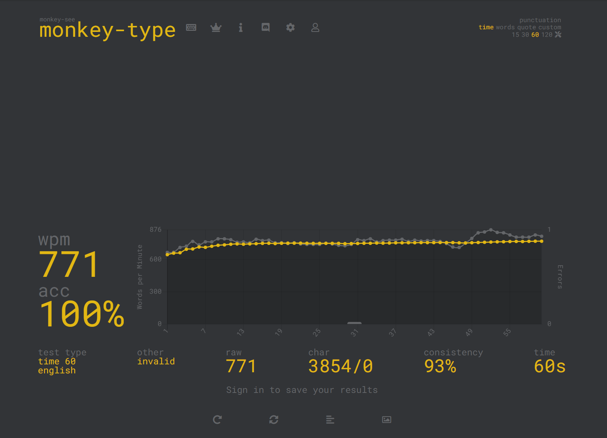

# Typing Master

I am a slow typer, my max wpm (word per minute) is 63.

So let me break the record with machines.

I wrote web crawlers to type and break the record.

# Instructions

The web crawler depends uses selenium python library which requires a browser driver, I used chrome driver.
You can download the latest verison here: https://chromedriver.chromium.org/, or you can use the one in this repo if it's compatible with your chrome browser.
I've uploaded the chrome driver for version 84.

Code are written in Jupyter Notebook, you can convert the notebook into pure python code, but remember to comment out the last line `browser.close()` if you want to see the result, or if you are running the notebook, don't run this line, otherwise browser closes and you will lose the result. 

## Monkey Type

[code](./monkey-type.ipynb)

https://monkey-type.com/

