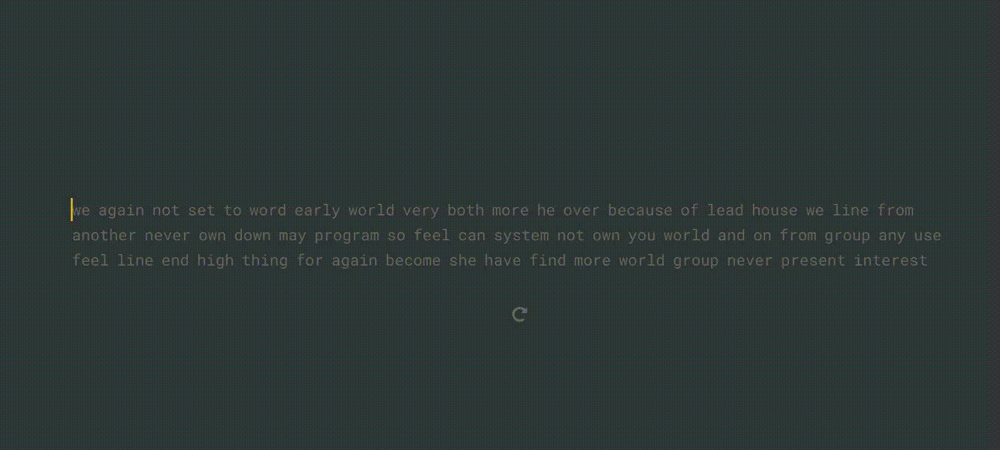
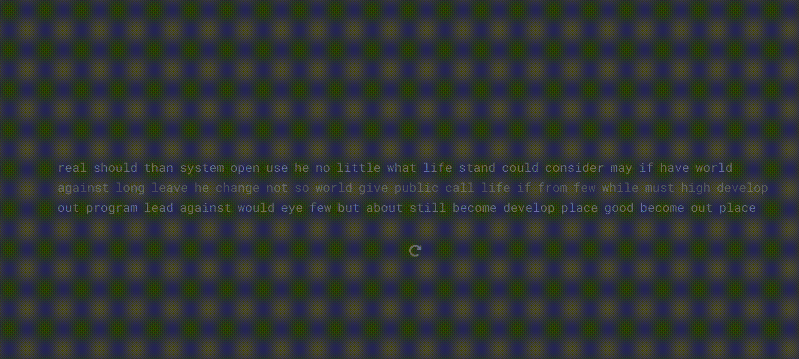

# Typing Master

I am a slow typer, my max wpm (word per minute) is 63.

So let me break the record with machines.

I wrote web crawlers to type and break the record.


# Instructions

### Chrome Driver

The web crawler depends uses selenium python library which requires a browser driver, I used chrome driver.
You can download the latest verison here: https://chromedriver.chromium.org/, or you can use the one in this repo if it's compatible with your chrome browser.
I've uploaded the chrome driver for version 84.	

| OS        | Driver                                                   |
| --------- | -------------------------------------------------------- |
| Windows32 | [chromedriver](./chromedrivers/chromedriver_win32.zip)   |
| MacOS     | [chromedriver](./chromedrivers/chromedriver_mac64.zip)   |
| Linux x64 | [chromedriver](./chromedrivers/chromedriver_linux64.zip) |

### Environment

I use Anaconda, this is my environment configuration: [environment.yml](./environment.yml)

Run `conda env create -f environment.yml` to create a conda environment.

However, the main library used is `selenium`, you could also simply install `selenium`.

```bash
conda install -c conda-forge selenium		# install with conda
pip install selenium						# install with pip
```

### Jupyter Notebook

Code are written in Jupyter Notebook, you can convert the notebook into pure python code, but remember to comment out the last line `browser.close()` if you want to see the result, or if you are running the notebook, don't run this line, otherwise browser closes and you will lose the result. 


## Monkey Type

[code](./monkey-type.ipynb)

https://monkey-type.com/


### Usage

There are 4 functions/methods, you can change the value of delay and method. 

Each method is of different styles with different techniques.

`delay` is for making the program more natural and more like a human typer. Typing too fast could be judged as invalid.

**The fastest method: 3**

**The most natural method: 4**

#### Method 1: one_letter_at_a_time

Find all words from the DOM, for each word and for each letter, send the letters one by one to the browser.

But since all words are extracted at once and then entered, when words used up and loading more, the program needs some time to wait for loading and do the calculation, there are lags between each iteration.



#### Method 2: all_letters_at_a_time

Similar to method 1.

Find all words from the DOM, construct a long string, and enter the entire string at once. After each run, some new words would be loaded and some calculation needs to be performed, so there is some lag between each iteration.



#### Method 3: one_word_at_a_time

This is the fastest method. Select the active word in every iteration and enter the entire word in each iteration.


#### Method 4: one_word_letter_at_a_time

Select the active word in every iteration and pop out each letter of the word, this is the most natural (human like) way.

A `delay` of 0.02 was given to make the behavior more human-like, so that this run wasn't judged to be invalid.


